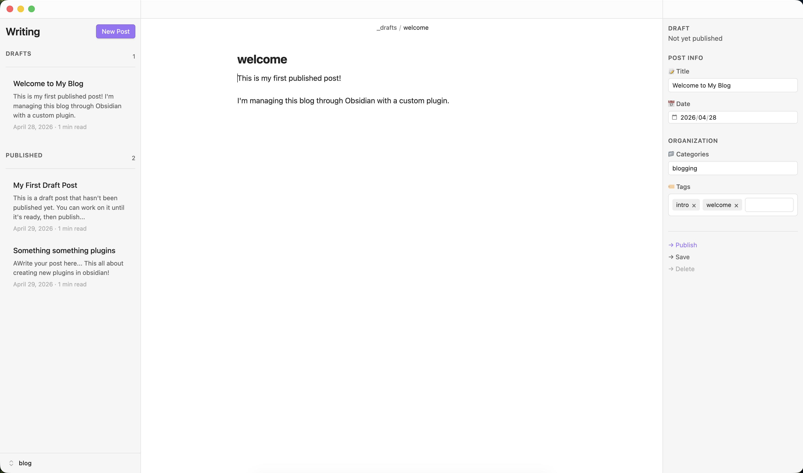

# Jequill

A beautiful, writer-focused Obsidian plugin to manage your Jekyll blog. Write in a distraction-free environment and publish with one click.

## Features

### Left Panel - Writing
- Clean post list grouped by **Drafts** and **Published**
- Post excerpts (first 20 words preview)
- Reading time estimates
- Elegant date formatting

### Right Panel - Admin
- Status display (Draft/Published with date)
- Interactive property editing:
  - 📅 Date picker
  - 🏷️ Tag pills with autocomplete
  - 📁 Category suggestions
- Quick actions: Publish, Save, Delete

### Minimal Workspace
- Auto-hides unnecessary UI elements
- Frontmatter hidden in editor (edit via properties panel)
- Clean, distraction-free writing environment
- Theme-aware design

## Installation

### Community Plugins (Coming Soon)

Once published to Obsidian's community plugins directory:
1. Open Obsidian Settings → Community Plugins
2. Search for "Jequill"
3. Click Install, then Enable

### Beta Testing with BRAT

Test pre-release versions using [BRAT](https://github.com/TfTHacker/obsidian42-brat) (Beta Reviewers Auto-update Tester):

1. Install the BRAT plugin from Obsidian's community plugins
2. Open BRAT settings → Add Beta Plugin
3. Enter: `hercobezuidenhout/jequill`
4. Enable "Jequill" in Community Plugins

BRAT will automatically update to new beta releases.

### Manual Installation

1. Download the latest release from [GitHub Releases](https://github.com/hercobezuidenhout/jequill/releases)
2. Download `main.js` and `manifest.json`
3. Create folder: `VaultFolder/.obsidian/plugins/jequill/`
4. Move both files to the folder
5. Reload Obsidian (Ctrl/Cmd + R)
6. Enable the plugin in Settings → Community Plugins

## Workflow

1. **Create**: Click "New Post" → Enter title → Start writing
2. **Write**: Focus on content (frontmatter hidden automatically)
3. **Edit Properties**: Use right panel for metadata
4. **Publish**: Click "→ Publish" in properties panel
   - Moves from `_drafts/` to `_posts/`
   - Adds date prefix if missing
   - Commits and pushes to git
5. **Unpublish**: Click "→ Unpublish" to move back to drafts
6. **Delete**: Click delete link for permanent removal

## Requirements

- Jekyll blog with `_drafts/` and `_posts/` folders
- Git repository initialized
- Obsidian 0.15.0+
